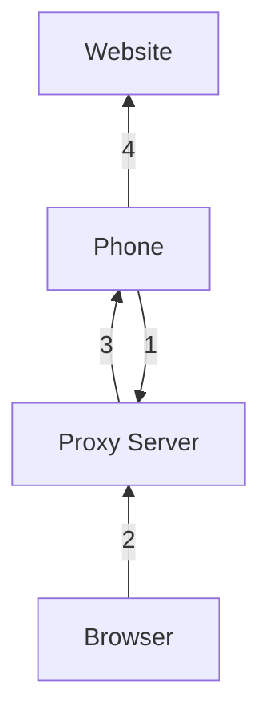

# Mobile Phone Proxy

This gives you a way to route your browser's internet traffic through an Android phone's mobile data connection.

## Components

- **Proxy Server** — a service that brokers connections between the browser and phone
- **Proxy Exit** — runs on the phone and connects to the Proxy Server
- **Browser** — configured to use the Proxy Server as an HTTP proxy

## Setup

### 1. Start the Proxy Server

Run this Docker command on a machine accessible from the internet:
```
docker run -d -p 8888:8888 -p 9999:9999 -e PROXY_AUTH_CODE=XXX registry.gitlab.com/viru7/proxy:latest
```

| Port | Purpose |
|------|---------|
| 8888 | Browser HTTP proxy connections |
| 9999 | Mobile app connections |

`XXX` is your chosen password.

If the server is on a home machine, ensure port **9999** is forwarded to it.

Note that the only thing in the docker image is a single file Java class, you can just run:
```
java server/src/main/java/com/github/vgaj/proxy/ProxyServer.java
```

### 2. Configure the app

Enter the server's IP address, port (`9999`), and your password, then tap **Start**.

### 3. Configure your browser

Set the browser's HTTP proxy to the server's IP address and port `8888`.

## How it works



1. The app connects to the Proxy Server, making the phone available as a proxy exit node.
2. When the browser needs to make an HTTP request, it sends it to the Proxy Server.
3. The Proxy Server forwards the request to the phone over the established connection.
4. The phone fetches the content via mobile data and returns it through the server to the browser.
