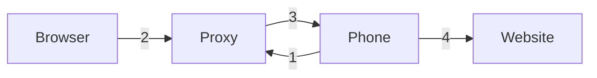

# Mobile Phone Proxy 
## Concept

1. The **Phone** connects to the **Proxy** to make itself available to be used as a proxy.
2. When the **Browser** needs an HTTP connection it connects to the **Proxy** via normal HTTP Proxy mechanisms.
3. The **Proxy** forwards the request to the **Phone** on the established connection.
4. The **Phone** connects to the **Website** specified in the HTTP proxy request.

