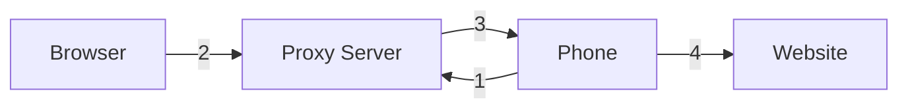

# Mobile Phone Proxy
This project gives you a way to route your browser's internet traffic through an Android phone's mobile data connection. If you want to access content that is geo-restricted to a specific country, this is a simple alternative to a commercial VPN - provided you have a trusted contact there with an Android phone. Unlike a VPN service, you control both ends of the connection: your contact runs the app on their phone and you connect through it directly, with no third-party servers involved beyond the relay you host yourself.

## How it works
##### Components
- **Proxy Server** - a service that brokers connections between the browser and phone
- **Proxy Exit** - runs on the phone and connects to the Proxy Server
- **Browser** - configured to use the Proxy Server as an HTTP proxy

##### Flow
1. The app connects to the Proxy Server, making the phone available as a proxy exit node.
2. When the browser needs to make an HTTP request, it sends it to the Proxy Server.
3. The Proxy Server forwards the request to the phone over the established connection.
4. The phone fetches the content via mobile data and returns it through the server to the browser.




## Setup

### 1. Start the Proxy Server

Run this Docker command on a machine accessible from the internet:
```
docker run -d -p 8888:8888 -p 9999:9999 -e AUTH_CODE=XXX registry.gitlab.com/viru7/proxy:latest
```

| Port | Purpose |
|------|---------|
| 8888 | Browser HTTP proxy connections |
| 9999 | Mobile app connections |

`XXX` is your chosen password.

If the server is on a home machine, ensure port **9999** is forwarded to it.

Note that what is inside the docker image is a single file Java class, so you can also just run:
```
java ProxyServer.java
```

### 2. Install and configure the Proxy Exit app

On your phone navigate to the following URL and download the APK for the Proxy Exit app: https://gitlab.com/viru7/proxy/-/jobs/13819560752/artifacts/browse/app/build/outputs/apk/release/

Install it following any Android prompts to allow the installation.

Open the app and enter the server's IP address, port (`9999`), and your password, then tap **Start**.

### 3. Configure your browser

Set the browser's HTTP and HTTPS proxy to the server's IP address and port `8888`.

## Building

Build from the command line with:

```
export ANDROID_HOME=/path/to/android/sdk
./gradlew assembleRelease
```
